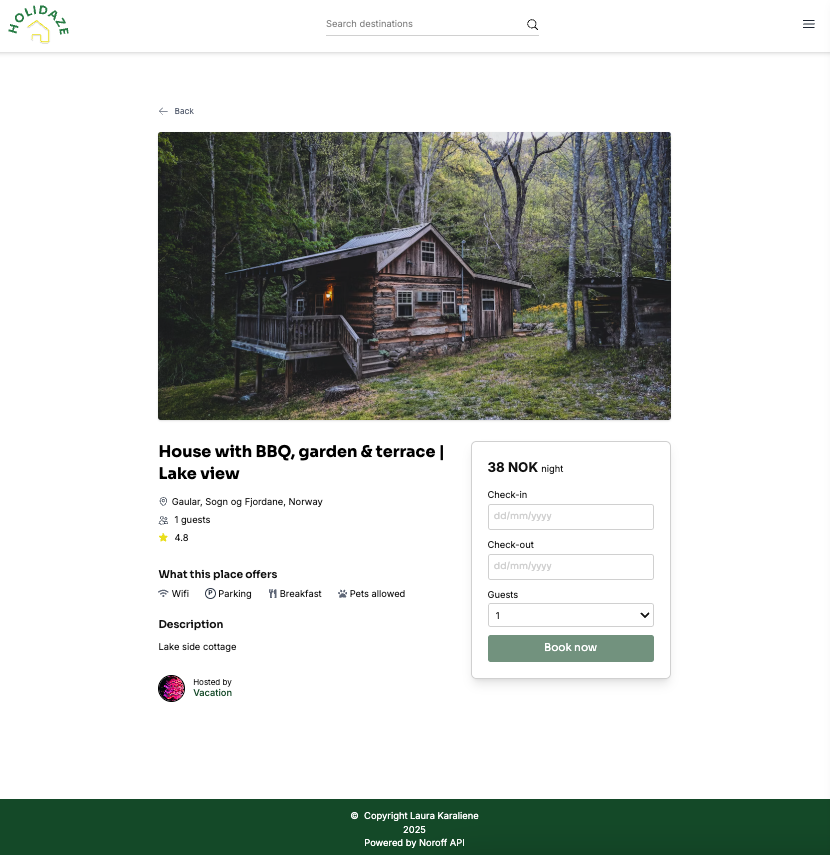

# Holidaze – Accommodation Booking Platform



**Holidaze** is a fictional accommodation booking platform where users can explore venues, make bookings, and manage their trips. Hosts can register, create, and manage their own venues. The site provides a modern and responsive experience with clean navigation, detailed venue information, and booking management features.

## Description

This project was created as part of Project Exam 2 at Noroff School of Technology to demonstrate advanced front-end development skills using **React**, **Tailwind**, and **React Router**. The application integrates with the **Noroff API** to handle venue listings, bookings, user authentication, and profile management.

### Goal

To build a fully functional front-end accommodation booking platform with both customer-facing and admin-facing functionality.

### Key Features

- **Venue Listing**: Browse a list of venues with images, pricing, ratings, and amenities.

- **Search Bar**: Search venues by name or phrase with live filtering.

- **Single Venue Page**: View detailed venue information, including location, price, amenities, and reviews.

- **Booking Flow**: Book venues and manage trips through your profile.

- **User Authentication**: Register, log in, and manage your profile.

- **Host Features**: Hosts can create, edit, and delete venues, and view bookings on their venues.

- **Responsive Design**: Optimized for both desktop and mobile devices.

### API Integration

The project uses the **Noroff API** v2, specifically the **/holidaze** endpoints:

- **Retrieve Venues**: Fetches available venues with details such as title, description, price, rating, media, and bookings.

- **Retrieve Venue Details**: Fetches detailed venue info including amenities and host profile.

- **Bookings**: Create and manage bookings for registered users.

- **Profiles**: Handle user profiles, including avatar, bio, and banner updates.

- **Authentication**: Register and log in with validation and error handling.

## Built With

-[React](https://reactjs.org/)

-[JavaScript](https://developer.mozilla.org/en-US/docs/Web/JavaScript)

-[Tailwind CSS](https://tailwindcss.com/docs/installation/using-vite)

-[React Router](https://reactrouter.com/)

-[Zustand](https://zustand-demo.pmnd.rs/)
(state management)

-[Netlify](https://www.netlify.com/)
(for deployment)

## Getting Started

## Installing

1. Clone the repository:

   ```bash
   git clone https://github.com/LauraKaraliene/holidaze.git

   ```

2. Navigate to the project's directory:

   ```bash
   cd holidaze

   ```

3. Open the project in your code editor:

   ```bash
   code .

   ```

4. Install dependencies:

   ```bash
   npm install

   ```

5. Start the development server:

   ```bash
   npm run dev

   ```

6. Build the project for production:

   ```bash
   npm run build

   ```

### Deployed Version

- **[Holidaze Live](https://bookmyholidayhome.netlify.app/)**
  – Try the live version here.

### Resources

- **[Noroff API Documentation](https://docs.noroff.dev/docs/v2)**
  – Learn more about the API used in this project.
